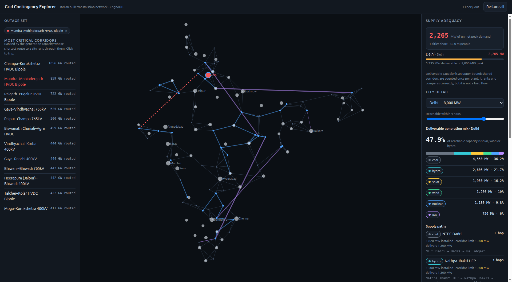
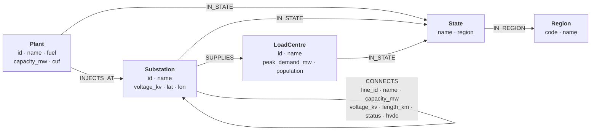

# Grid Contingency Explorer

Take a transmission line out of service and watch which Indian cities can no
longer be supplied to their peak demand — and which fuels they lose access to.

**FastAPI** backend on the official `neo4j` Python driver, talking to **CognoDB**
over Bolt. **Next.js** front end, shipped as a static export that FastAPI serves
itself — one process, one origin, one URL.



---

## The use case

India's bulk power system is a mesh of ~112 extra-high-voltage substations tied
together by 765 kV AC corridors and a handful of very long HVDC bipoles. Roughly
50 large generating stations inject into it; roughly 60 cities draw from it.

The questions that matter to a grid planner are not about rows. They are about
**routes**:

- If the Mundra–Mohindergarh bipole trips, how much generation can still reach
  Delhi, and along which corridors?
- Which single line, if lost, strands the most generating capacity?
- What share of the power a city can actually draw on is renewable — and does
  that share survive an outage on the corridor from the solar parks?

Every one of those is a question about paths of unknown length through a network,
which is what this application answers.

## Why a graph database?

The central query is: *for each city, find the highest-capacity route to each
generator, where the route length is not known in advance and some lines are out
of service.* In Cypher that is one statement:

```cypher
MATCH (sink:Substation)-[:SUPPLIES]->(:LoadCentre {id: $loadId})
MATCH (pl:Plant)-[:INJECTS_AT]->(src:Substation)
MATCH p = (sink)-[:CONNECTS*0..5]-(src)
WHERE all(r IN relationships(p)
          WHERE r.status = 'IN_SERVICE' AND NOT r.line_id IN $tripped)
WITH pl, max(reduce(m = 1000000.0, r IN relationships(p) |
       CASE WHEN r.capacity_mw < m THEN r.capacity_mw ELSE m END)) AS widest
RETURN pl.name,
       CASE WHEN pl.capacity_mw < widest THEN pl.capacity_mw ELSE widest END
         AS deliverable_mw
```

Three things there have no clean relational equivalent:

1. **Variable-length traversal.** `*0..5` walks one to five hops without knowing
   how many are needed. A recursive CTE can enumerate rows at increasing depth,
   but it must be re-written for each query shape and it does not hand you the
   route.
2. **The path as a value.** `reduce(… , r IN c | …)` folds over the edges of a
   path. SQL has no path object to fold over; you would materialise every
   candidate route into a temp table and aggregate over it procedurally.
3. **Max-of-min over a path set.** `max(reduce(min …))` is the widest-path
   problem — the best bottleneck across all routes. Expressing that in SQL means
   either a stored procedure or shipping the whole edge list to the application
   and solving it there, at which point the database is just a file store.

The outage set is a single bound parameter, `$tripped`. Adding a line to it
re-plans every route in the country on the next query. There is no schema change,
no join graph to rebuild, and no denormalised "reachability" table to invalidate.

**What a relational schema would still do better:** the seed data itself is
rectangular. Plants, substations and cities are flat entities with fixed columns,
and `SELECT * FROM plant WHERE state = 'Gujarat'` needs nothing a graph offers.
The graph earns its place on the traversal, not the storage.

## Data model



| Label / type | Count | Notes |
|---|---:|---|
| `Substation` | 112 | Real 400/765 kV and HVDC terminals |
| `CONNECTS` | 230 | Transmission corridors, average degree 4.1 |
| `Plant` | 49 | Real stations, all seven fuel types |
| `LoadCentre` | 60 | Real cities with approximate peak demand |
| `State` / `Region` | 27 / 5 | The five regional grids |

### Two modelling decisions worth defending

**A transmission line is a relationship, not a node.** Modelling it as a node
would force every traversal through `(:Sub)-[:END_A]-(:Line)-[:END_B]-(:Sub)`,
doubling the hop count and making `*1..5` mean something different from five
electrical hops. The cost of the choice is real: you cannot attach an
`OutageEvent` node to a relationship. If outage *history* were needed, outages
would be stored as `(:OutageEvent {line_id})` and joined in the application
layer. This is the model's one deliberate compromise.

**`CONNECTS` is stored once and traversed undirected.** Power flows both ways
along a line. Writing both directions would double the edge count for no gain, so
every query uses `-[c:CONNECTS*0..5]-` without an arrow.

## The queries

All live in [`backend/app/queries.py`](backend/app/queries.py), named and commented. All
are parameterised — there is no string-concatenated Cypher anywhere in the repo.

| | Question | Technique |
|---|---|---|
| **Q1/Q2** | Which generators can still supply this city, by what route, and what is the weakest link on it? | Variable-length pattern, `reduce` bottleneck, ordered `collect(...)[0]` to keep the best route |
| **Q3** | Which cities cannot be supplied to their peak demand under the current outage set? | Widest-path capacity per city, `OPTIONAL MATCH` so fully islanded cities still aggregate to zero |
| **Q3b** | Is any city completely cut off from all generation? | Multi-source expansion, set difference |
| **Q4** | Which corridors carry the most generation? | `shortestPath` across all plant/city pairs, weighted by plant capacity |
| **Q5** | What generation mix can this city actually draw on? | Widest path per plant, grouped by fuel |

Q1, Q3, Q4 and Q5 are all multi-hop (2+); Q2 (`max` of `reduce` over a
variable-length path) is the one a relational database finds genuinely awkward.

### An honest limit

Deliverable capacity is computed as the sum over reachable plants of
`min(plant capacity, widest-path bottleneck)`. A corridor shared by several
plants is therefore counted once per plant, which makes the figure an **upper
bound** on what could really be delivered — a screening heuristic, not an AC load
flow. It ranks and compares correctly; it does not predict dispatch. The correct
model is a max-flow, which openCypher cannot express without a graph-algorithms
library. The UI states this alongside the number.

### A design decision that came out of testing

The first version of Q3 asked the obvious question: *does any generator still
have a path to this city?* Measured against the seeded network, the answer was
"yes" for **all 230 single-line outages and all 26,335 two-line outages** — with
generation at 44 of 112 substations, pure reachability is nearly impossible to
break, so the query never said anything. Switching the criterion to deliverable
capacity against peak demand made 12 of the 230 single-line trips produce a real
shortfall, which is both the physically meaningful question and a discriminating
one. The reachability query is kept as Q3b because full islanding is still the
extreme case worth reporting.

## Data provenance

Read this before quoting any number from the app.

- **Real:** substation names and voltages, generating station names, fuels and
  installed capacities, city names and approximate peak demands, and the seven
  HVDC bipoles. Sourced from public CEA / Grid-India material and rounded.
- **Approximate:** coordinates point at the named town, not the surveyed
  switchyard.
- **Synthetic:** the AC corridor topology. It is generated in
  [`backend/scripts/dataset.py`](backend/scripts/dataset.py) by connecting each substation to
  its three nearest neighbours within 450 km, adding the real long-haul
  corridors, then repairing the graph until it is connected. Generation is
  deterministic — no randomness — so re-seeding reproduces the same network.

The result is structurally realistic and electrically illustrative. It is a
graph-modelling demonstrator, not a planning tool.

## Running it

### 1. Create a CognoDB instance

1. Sign up at [console.cognodb.com](https://console.cognodb.com/signup) — the
   free tier needs no credit card.
2. Create a free (`c0`) instance and pick a region. It provisions in under a
   minute.
3. Copy the connection URI and the generated password for the user `cognodb`.
   **The password is shown exactly once.**

### 2. Configure

```bash
cp .env.example .env      # then fill in COGNODB_URI and COGNODB_PASSWORD
```

`.env` is gitignored. No credential is ever committed; the application reads all
connection details from the environment.

### 3. Backend

```bash
cd backend
python -m venv .venv && .venv/bin/pip install -r requirements.txt
.venv/bin/python -m scripts.seed     # idempotent; --reset wipes first
.venv/bin/python -m scripts.smoke    # runs every query, prints rows and timings
```

### 4. Frontend

```bash
cd frontend
npm install
npm run build           # emits a static export to frontend/out
```

### 5. Serve

```bash
cd backend && .venv/bin/uvicorn app.main:app --port 8000
```

FastAPI serves the API under `/api` and the built frontend at everything else, so
<http://localhost:8000> is the whole application. Interactive API docs are at
`/docs`.

For development with hot reload on both sides, `./run-dev.sh` runs uvicorn on
:8000 and `next dev` on :3000, with `NEXT_PUBLIC_API_BASE` bridging them.

## Using it

- **Click any corridor on the map** to take it out of service. Everything
  recomputes against the surviving network.
- **Click a city, or pick one from the dropdown**, to see the routes that supply
  it, the bottleneck on each, and its deliverable fuel mix.
- **The left panel ranks corridors** by the generation routed through them.
  Clicking one trips it.
- Good ones to try: *Mundra–Mohindergarh HVDC* (strands Gujarat's coal from
  Delhi — 2,265 MW short), *Ballabgarh–Bhiwadi 400kV* (the largest single-line
  shortfall in the network), *Champa–Kurukshetra HVDC* (the most heavily loaded
  corridor, which the network nonetheless survives).

## Architecture

```
backend/
  app/
    config.py        Settings from the environment; masks the instance id in logs
    db.py            Async driver singleton, read helper, unreachable-vs-broken
    queries.py       Every Cypher statement, named and commented
    models.py        Pydantic response models — the frontend types mirror these
    routers/grid.py  The six endpoints
    main.py          App wiring, error handlers, static mount
  scripts/
    dataset.py       Seed data loading, corridor generation, Q4 precompute
    seed.py          Idempotent, UNWIND-batched loader
    smoke.py         Runs every query against a live instance
  data/grid.json     The seed dataset
frontend/
  src/lib/api.ts     Typed fetch client; one place where an error becomes a state
  src/app/page.tsx   Client orchestration: outage set, selected city, hop limit
  src/components/    GridMap (SVG) · Panels
```

**One driver per process.** The Neo4j driver is a connection pool, not a
connection. Building one per request would exhaust the free tier's 200-connection
ceiling under trivial load, so `db.py` holds a single async driver and caps the
pool at 10.

**Failure has one shape.** `db.py` separates "the database is not there" from
"the query is wrong". The first becomes a 503 with `{"unreachable": true}` and a
retry banner in the UI; the second a 500 and a full server-side log. Missing
credentials are caught at driver construction and reported as configuration, not
connectivity. A failed probe at startup is logged but does **not** stop the app
booting — the UI then renders its unreachable state with a retry, which beats a
container that crash-loops out of sight.

**No string-built Cypher.** Every parameter is bound. The one thing Cypher cannot
parameterise — the upper bound of a variable-length pattern — is a literal in the
query, narrowed by `length(p) <= $maxHops`.

## Writing for CognoDB, not Neo4j

CognoDB speaks openCypher over Bolt and works with the Neo4j drivers, but it is a
different engine. Three differences were found by probing the live instance, and
every query in `queries.py` is written for them:

| Neo4j accepts | CognoDB | What the code does |
|---|---|---|
| `all(r IN c …)` on a variable-length relationship variable | fails: *"all() requires list, got \*types.Path"* | binds the path (`MATCH p = …`) and uses `relationships(p)` |
| `size(c)` on the same variable | fails the same way | `length(p)` |
| `round(x, 1)` | fails: one argument only | `round(x * 10) / 10.0` |

Everything else used here — `reduce`, `nodes(p)` comprehensions, ordered
`collect(...)[0]`, `reverse()`, `shortestPath`, `toInteger()` in `LIMIT`,
`coalesce` — was verified working.

### Performance on the free tier

The `c0` instance is 0.5 vCPU burstable, and it shows. Measured against the live
instance:

| Query | Time | Notes |
|---|---:|---|
| Q3 adequacy | 0.3–1.6 s | runs on every click |
| Q1/Q2 supply paths | 1.7 s | per selected city |
| Q5 fuel mix | 1.6 s | per selected city |
| Q3b islanding | 5.3 s | only run when a shortfall exists |
| Q4 as a live traversal | **timed out** | ~2,600 `shortestPath` searches |

Two changes came out of that, both in the code with the reasoning attached:

1. **Q4 is precomputed at seed time.** The corridor ranking is a pure function of
   the topology — it does not depend on the outage set — so `compute_corridor_load()`
   calculates it during seeding and stores `mw_carried` on each relationship. The
   API reads a property and sorts. The live traversal is kept as
   `CRITICAL_LINES_LIVE` and can be run with `python -m scripts.smoke --live-q4`;
   Neo4j answers it in ~190 ms, CognoDB in 19 s before it began exceeding its
   statement deadline. Precomputing what cannot change is the honest fix.
2. **The islanding check only runs when it can return something.** A fully
   islanded city has zero deliverable capacity, which is necessarily below its
   peak demand, so the islanded set is a strict subset of the at-risk set. If
   nothing is short, nothing can be islanded — and 5.3 s leaves the hot path.

The static topology and the corridor ranking are also cached in the API process,
since neither changes until the graph is re-seeded.

## Verified against both engines

The queries were developed against Neo4j 5.26 in Docker and then run against the
live CognoDB instance. Both engines independently produce the same answer: with
the Mundra–Mohindergarh bipole out, Delhi is **2,265 MW short** of its 8,000 MW
peak, and its coal share falls from 41.4% to 36.2%. An exhaustive N-1 sweep on
Neo4j found **12 of 230** single-line outages produce a shortfall.

## Deployment

Any host that runs a Python process works — Render, Railway and Fly.io all have a
free tier that does.

```bash
cd frontend && npm ci && npm run build      # build step
cd backend  && pip install -r requirements.txt
uvicorn app.main:app --host 0.0.0.0 --port $PORT   # start command
```

Set `COGNODB_URI`, `COGNODB_USER` and `COGNODB_PASSWORD` in the host's
environment. Keep `COGNODB_MAX_POOL_SIZE` modest: the free `c0` instance allows
200 connections in total.

## One more portability note

**Constraints and indexes are Neo4j DDL, not part of openCypher.** The seed
script attempts them and carries on if the server rejects any, printing which it
skipped. Every write uses `MERGE` on a natural key, so the load stays idempotent
either way — just slower without the index. CognoDB accepted all five.
